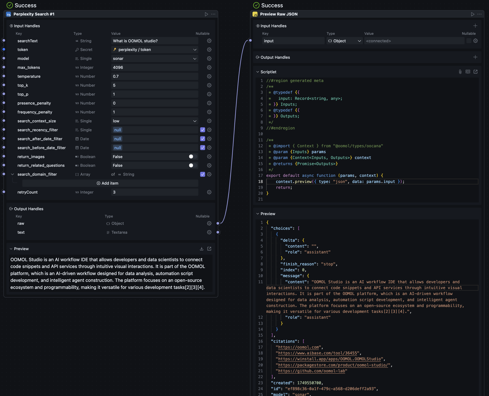

# Perplexity Search Block

A powerful OOMOL workflow block that enables intelligent web searching using Perplexity AI's advanced search capabilities. This block allows you to search the web, get AI-powered answers, and integrate real-time information into your workflows.

## 🔍 What is Perplexity Search?

Perplexity Search is an AI-powered search engine that doesn't just return links - it provides comprehensive, well-researched answers to your questions by analyzing multiple web sources in real-time. This block brings that power directly into your OOMOL workflows.

## ✨ Key Features

- **AI-Powered Answers**: Get intelligent responses based on current web information
- **Multiple Search Models**: Choose from various Perplexity models optimized for different tasks
- **Advanced Filtering**: Filter results by date, domain, and recency
- **Customizable Parameters**: Fine-tune response quality and creativity
- **Rich Output**: Get both structured data and formatted text responses
- **Automatic Retry**: Built-in retry mechanism for reliable performance

## 🚀 How to Use

### Basic Setup

1. **Get your Perplexity API Token**:
   - Visit [Perplexity API Settings](https://www.perplexity.ai/settings/api) and sign up for an account
   - Generate your API key from your account dashboard
   - Keep this token secure - you'll need it for the block

2. **Add the Block to Your Workflow**:
   - Drag the Perplexity Search block into your workflow
   - Connect it to other blocks as needed

3. **Configure the Search**:
   - Enter your search query in the "Search Text" field
   - Add your Perplexity API token
   - Adjust other settings as needed

### Input Parameters

#### Required Inputs
- **Search Text**: Your question or search query
- **Token**: Your Perplexity API authentication token

#### Model Selection
Choose the best model for your needs:
- **sonar**: Fast, general-purpose searching (default)
- **sonar-pro**: Enhanced accuracy for complex queries
- **sonar-deep-research**: In-depth analysis and research
- **sonar-reasoning-pro**: Advanced logical reasoning
- **sonar-reasoning**: Balanced reasoning capabilities
- **r1-1776**: Specialized model variant

#### Response Control
- **Max Tokens** (4096): Maximum length of the response
- **Temperature** (0.7): Creativity level (0 = focused, 2 = creative)
- **Top K** (5): Number of top choices to consider
- **Top P** (1): Probability threshold for word selection
- **Presence Penalty** (0): Encourages discussing new topics
- **Frequency Penalty** (1): Reduces repetitive content

#### Search Filtering
- **Search Context Size**: Choose from low/medium/high (affects cost and detail)
- **Recency Filter**: Limit to recent content (day/week/month/year)
- **Date Filters**: Search content published before/after specific dates
- **Domain Filter**: Restrict or exclude specific websites (up to 10 domains)

#### Additional Options
- **Return Images**: Include relevant images in results
- **Return Related Questions**: Get suggested follow-up questions
- **Retry Count** (3): Number of retry attempts if the request fails

## 📊 Output

The block provides two types of output:

1. **Raw Data**: Complete API response with all metadata
2. **Text**: Clean, formatted text response ready for display or further processing

The results are automatically displayed in a user-friendly format within the OOMOL interface.

## 🎯 Use Cases

### Research and Analysis
- Market research and competitor analysis
- Academic research and fact-checking
- News gathering and current events monitoring
- Technical documentation lookup

### Content Creation
- Blog post research and ideation
- Social media content inspiration
- Product description enhancement
- Educational material development

### Business Intelligence
- Industry trend analysis
- Customer sentiment research
- Regulatory updates and compliance
- Investment research and analysis

### Personal Productivity
- Travel planning and recommendations
- Shopping research and comparisons
- Health and wellness information
- Learning and skill development

## 💡 Pro Tips

1. **Craft Better Queries**: Be specific and clear in your search text for better results
2. **Use Date Filters**: For time-sensitive information, apply appropriate date filters
3. **Experiment with Models**: Different models excel at different types of queries
4. **Adjust Temperature**: Lower values for factual queries, higher for creative tasks
5. **Domain Filtering**: Use domain filters to focus on authoritative sources
6. **Combine with Other Blocks**: Chain with text processing, analysis, or output blocks

## 🔧 Technical Details

- **Runtime**: Node.js/TypeScript
- **API**: Perplexity AI Chat Completions
- **Retry Logic**: Automatic retry with configurable attempts
- **Output Format**: JSON and markdown support

## 🛡️ Security & Privacy

- Your API token is securely handled and not logged
- Search queries are processed through Perplexity's secure infrastructure
- No search history is stored locally

## 📚 Need Help?

- Check the [Perplexity AI API Documentation](https://docs.perplexity.ai/api-reference/chat-completions-post)
- Visit the [OOMOL Documentation](https://docs.oomol.com) for workflow guidance
- Join the OOMOL community for support and examples

---

*This block is part of the OOMOL ecosystem - build powerful, visual workflows without coding.*
